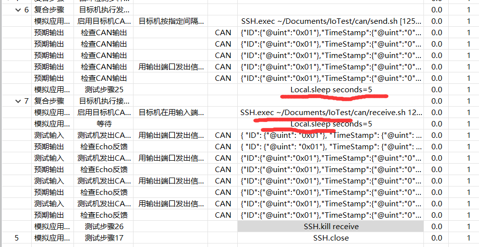

## IoTest

---
Linux下使用ifconfig -a查看can0是否打开

#### can 测试用例详解

1. 检测can设备是否连接正确

2. 远程连接目标机ip，password；

3. 上传本地的`send.sh、receive.sh`和与其配套的可执行文件

4. 复合步骤中的总体流程如下：
    1. 先验证目标机的发送功能：
    2. 再验证目标机的接收功能，目标机接收到**Iotest** 的can数据后，再由目标机的发送功能来发送接收的数据到**IoTest**，然后来验证数据正确性。
    3. 综上，要验证目标机的接收功能，前提是验证了目标机的发送功能。所以测试用例的设计是先**1**，后**2**。

#### 脚本sendcan.sh解释

send.sh接收四个参数，分别是**bitrate**,**id**,**dataLength**,**data**，其中数据格式为AA-BB-CC类似。

验证可执行程序是否存在 

执行命令打开can0接口  `sudo ip link set can0 up type can bitrate $bitrate`

执行命令关闭can接口 `sudo ip link set can0 down`

#### 脚本receivecan.sh解释

receive.sh接收一个参数，**bitrate**.

#### IoTest注意事项

1. 当设计多个读取和发送案例时，请注意使用`Local.sleep`来防止读取或发送接口为来的即打开数据已经到达,如图

2. 树莓派上连线结束后，请用`ifconfig -a`查看can0是否打开,如果未打开请重启`sudo reboot`。

3. can在IoTest上有两个测试用例，原来的和新设计的。