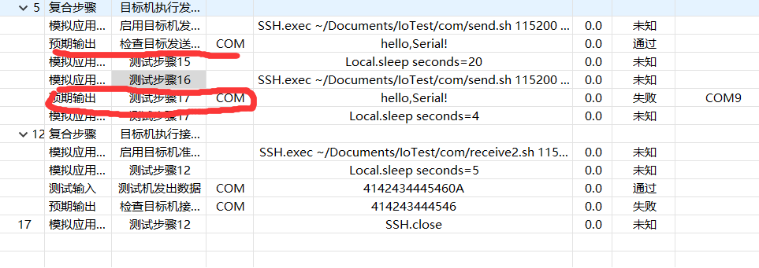
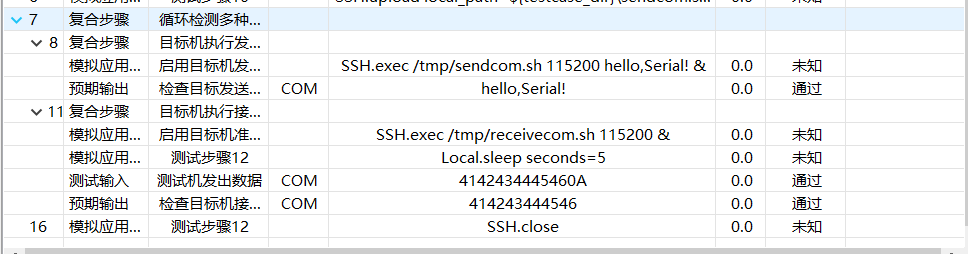

## COM

---

#### 下载libserial

使用 `apt-get` 命令从默认的软件源中安装 `libserial-dev` 软件包，可以按照以下步骤进行：

1. **更新软件包列表：**

   打开终端，并运行以下命令以确保软件包列表是最新的：

   ```bash
   sudo apt-get update
   ```

2. **安装 `libserial-dev` 软件包：**

   运行以下命令以安装 `libserial-dev` 软件包：

   ```bash
   sudo apt-get install libserial-dev
   ```

   上述命令会自动安装 `libserial-dev` 及其依赖项。

3. **验证安装：**

   可以通过运行以下命令来验证是否成功安装了 `libserial-dev`：

   ```bash
   dpkg -l | grep libserial
   ```

   如果安装成功，你应该看到包含 `libserial` 的信息。

请注意，这种方式安装的 `libserial-dev` 可能不是最新版本。如果需要使用最新版本，可以按照从源代码编译的方式。

#### 测试用例讲解

1. 检测com设备是否连接正确

2. 远程连接目标机ip，password；

3. 上传本地的`sendcom.sh、receivecom.sh`和与其配套的可执行文件

4. 复合步骤中的总体流程如下：
    1. 先验证目标机的发送功能：做几个不同波特率的传输；
    2. 再验证目标机的接收功能，目标机接收到**Iotest** 的can数据后，再由目标机的发送功能来发送接收的数据到**IoTest**，然后来验证数据正确性。
    3. 综上，要验证目标机的接收功能，前提是验证了目标机的发送功能。所以测试用例的设计是先**1**，后**2**。

#### 必要讲解

1. 本机测试com端口要连接COM9那一端，注意别连接反了

2. 测试通过的比特率大部分都是9600，115200

3. IoTest想发送数据时，最后带上换行。数据传输结束标志

4. 有时设备灯不亮，说明设备连线问题

5. 有事灯亮，也会发生数据接收异常，说明设备接收功能有问题

#### IoTest软件存在的问题

1. 当做完一次数据接收后；（就算在两次动作之间增加延时动作，也不行）如果在后面继续做一次接收动作，IoTest程序将要出错 第二次send.sh的发送的数据，紧接着的预期输出操作无法无法接收到；反而在下一次接收步骤中收到。

2. 所以最好的测试用例就是如下截图所示：图中414243等是十六进制对abc...,0A是换行。

3. 注意发送读取时，时间的先后问题。**防止树莓派数据已经发送了，而IoTest接收端还未打开。**


#### IoTest com错误定位

1. `SerialTransmitter.java function openSerialPort line:287`,错误显示一般是`错误：COM9
   ```java
    CommPort commPort = portIdentifier.open(serialPortName, (int)timeout);
   ```


#### IoTest 240228 串口问题所在

1. Iotest中某串口打开之后，在接下来的接收和发送操作中，是没有执行`closeSerialPort()`的，导致串口一直处于打开状态。所以当调整波特率时，会出现`错误：COM9`

2. 尝试在程序中添加`closeSerialPort()`，但是会出现线程报错，可能是线程的同步问题。
   `java.util.concurrent.RejectedExecutionException: Task java.util.concurrent.FutureTask@23f1d962 rejected from java.util.concurrent.ThreadPoolExecutor@16caa3d4[Terminated, pool size = 0, active threads = 0, queued tasks = 0, completed tasks = 1]`