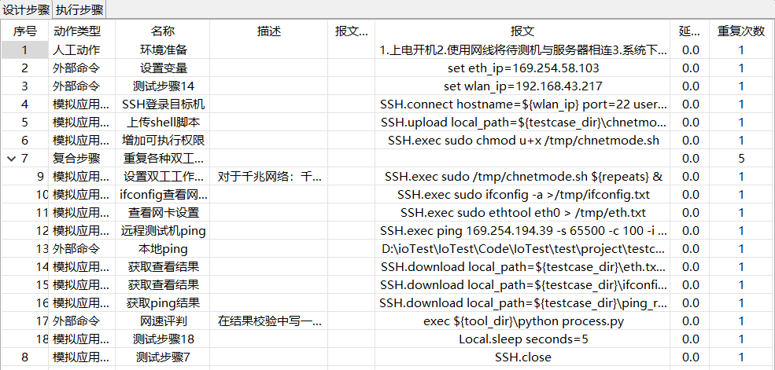

## NET


#### 存在问题

1. 直接使用`${testcase_dir}\ping_local.bat ${wlan_ip}`无法使用

2. `python process.py`

3. 未修改前测试用例
   


#### 解决方案

##### 问题1
在`TestExecutor.java line 1195`添加`for`循环修改从0开始

##### 问题2
1. 在`TestExecutor.java line 1101` 添加 tool_dir 用于获取python.exe路径
2. 在变量中添加${tool_dir}

3. 为了让程序正确执行，`CmdRunner.java function runCommand`添加了部分代码
    ```java
   if ("exec".equals(cmd.get(0))){
      cmd = new ArrayList<>(cmd.subList(1, cmd.size()));
   }
    // before builder.command(cmd); add
    ```
4. 命令行的正确输入是
   ```shell
   exec ${tool_dir}\python process.py
   # 当前process.py存在在此测试用例的目录下
   ```
5. 没有在变量中添加`${tool_dir}`.
