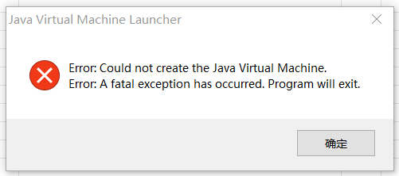

```python
import multiprocessing


# 第二个函数的定义
def trim_and_compare_audio(file1, file2, result_queue):
    import librosa
    import numpy as np
    
    y1, sr1 = librosa.load(file1)
    y2, sr2 = librosa.load(file2)

    duration1 = librosa.get_duration(y=y1, sr=sr1)
    duration2 = librosa.get_duration(y=y2, sr=sr2)

    if duration1 > duration2:
        samples_to_keep = int(duration2 * sr1)
        y1_trimmed = y1[:samples_to_keep]
        y2_trimmed = y2
    elif duration1 < duration2:
        samples_to_keep = int(duration1 * sr2)
        y1_trimmed = y1
        y2_trimmed = y2[:samples_to_keep]
    else:
        y1_trimmed = y1
        y2_trimmed = y2

    mfcc1 = librosa.feature.mfcc(y=y1_trimmed, sr=sr1)
    mfcc2 = librosa.feature.mfcc(y=y2_trimmed, sr=sr2)

    min_length = min(mfcc1.shape[1], mfcc2.shape[1])
    mfcc1 = np.resize(mfcc1, (min_length,))
    mfcc2 = np.resize(mfcc2, (min_length,))

    similarity = np.dot(mfcc1, mfcc2) / (np.linalg.norm(mfcc1) * np.linalg.norm(mfcc2))
    
    result_queue.put(round(similarity, 2))

# 第一个函数的定义
def process_audio(src, dest):
    print(src)
    print("process_audio")

    # 创建结果队列
    result_queue = multiprocessing.Queue()
    try:
        audio_process = multiprocessing.Process(target=trim_and_compare_audio, args=(src, dest, result_queue))
        audio_process.start()
        audio_process.join()
    
        if audio_process.exitcode == 0:
            print("子进程成功执行完毕")
        else:
            print(f"子进程异常退出，错误码: {audio_process.exitcode}")
    
    except Exception as e:
        print(f"子进程执行时发生异常: {e}")

    global result
    threshold = 0.60
    # 从结果队列获取第二个函数的返回结果
    similarity = result_queue.get()
    if similarity >= threshold:
        result = True
```
当在java程序中调用process_audio时（已经src,dest参数完全正确）

会出现以下报错


子进程异常退出，错误码: 1