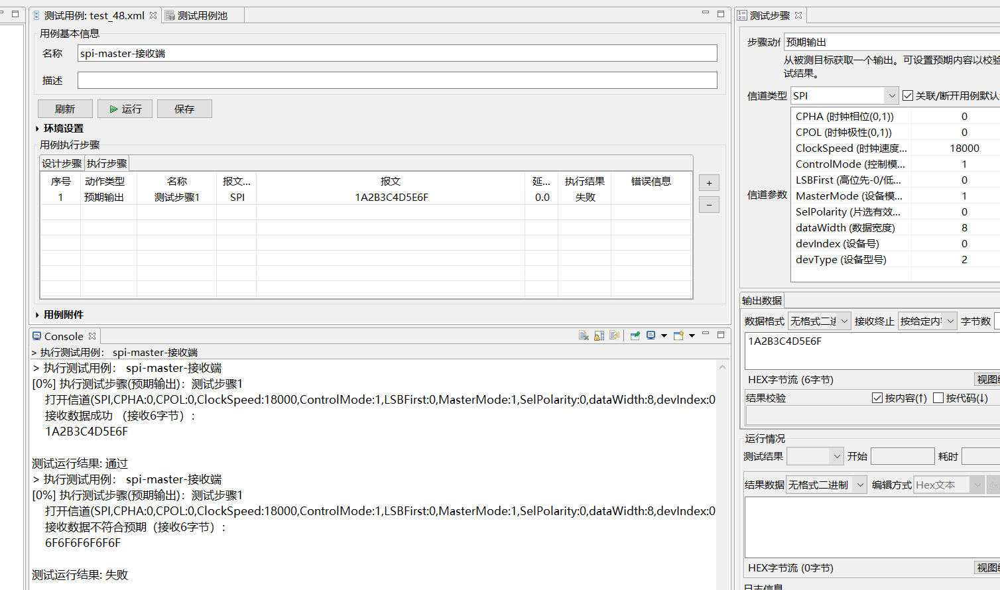
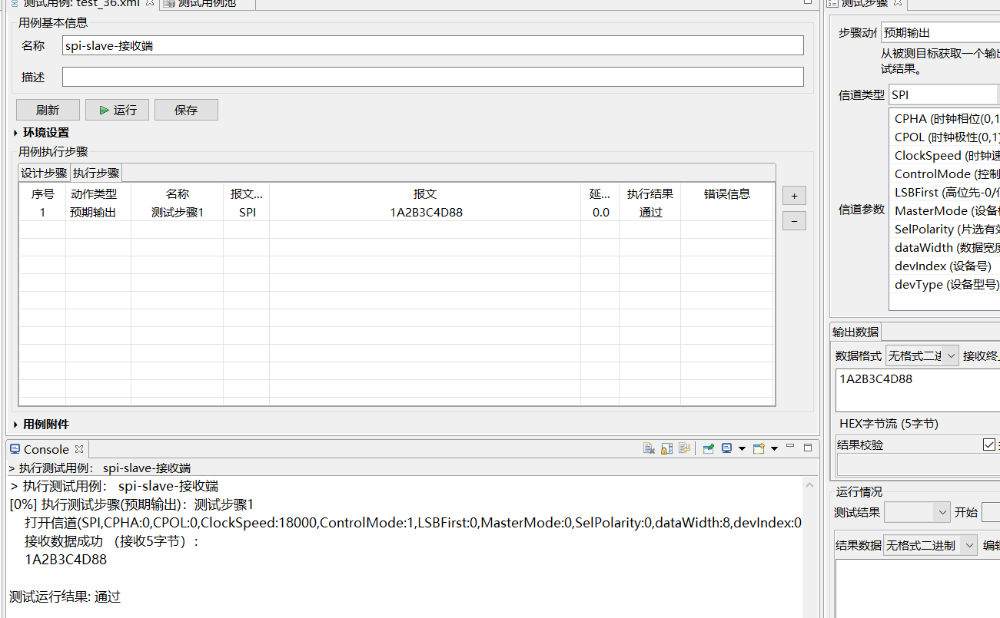

##### 已解决
- **gpio**完成
- **spi**主从发送可以正确接收（实际应用需要自己设计协议）
    - spi-master-接收端
    

    - spi-slave-接收端
    
- 网络测试用例添加`${tool_dir}`完成，测试用例的网络接口无法改为一个

##### 问题
- 音频处理，另开一个进程也一直报错。
- com 读取debug待做
- i2c

